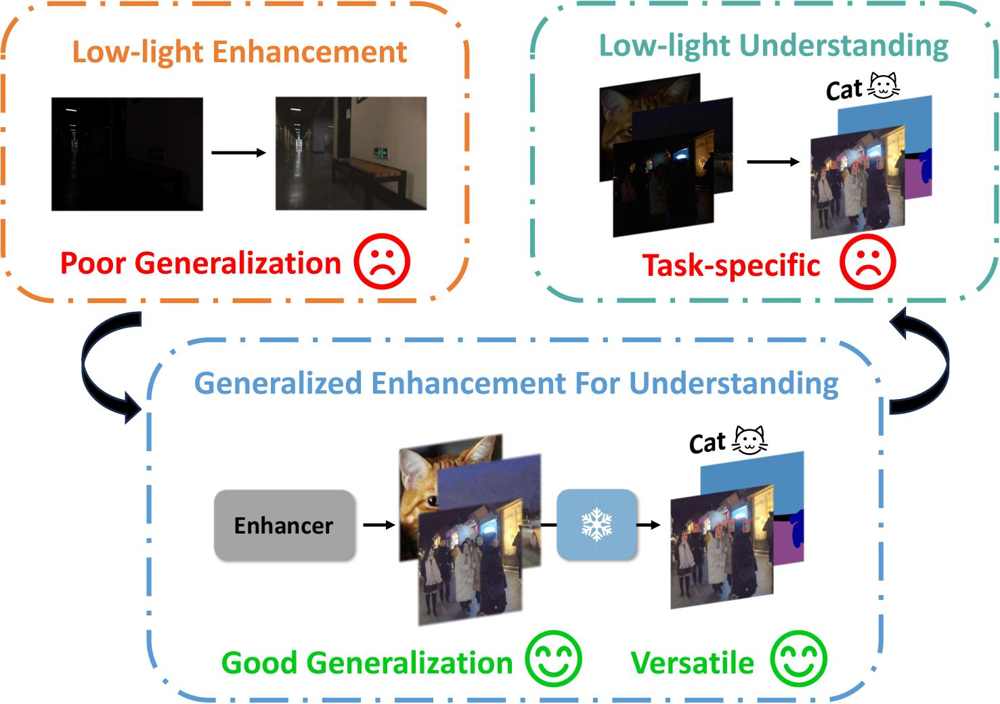

<h2 align="center">
  <b>From Enhancement to Understanding: Build a Generalized Bridge for Low-light Vision via Semantically Consistent Unsupervised Fine-tuning</b>

  <b><i> ICCV 2025</i></b>
    [<a href="https://arxiv.org/abs/2507.08380">arXiv</a>]
</h2>

<div align=center>

</div>

## Abstract
Low-level enhancement and high-level visual understanding in low-light vision have traditionally been treated separately. Low-light enhancement improves image quality for downstream tasks, but existing methods rely on physical or geometric priors, limiting generalization. Evaluation mainly focuses on visual quality rather than downstream performance. Low-light visual understanding, constrained by scarce labeled data, primarily uses task-specific domain adaptation, which lacks scalability. To address these challenges, we build a generalized bridge between low-light enhancement and low-light understanding, which we term Generalized Enhancement For Understanding (GEFU). This paradigm improves both generalization and scalability. To address the diverse causes of low-light degradation, we leverage pretrained generative diffusion models to optimize images, achieving zero-shot generalization performance. Building on this, we propose Semantically Consistent Unsupervised Fine-tuning (SCUF). Specifically, to overcome text prompt limitations, we introduce an illumination-aware image prompt to explicitly guide image generation and propose a cycle-attention adapter to maximize its semantic potential. To mitigate semantic degradation in unsupervised training, we propose caption and reflectance consistency to learn high-level semantics and image-level spatial semantics. Extensive experiments demonstrate that our proposed method outperforms current state-of-the-art methods in traditional image quality and GEFU tasks including classification, detection, and semantic segmentation.

## Preparation
### 1. setup environment

```shell
conda create -n scuf python=3.10
conda activate scuf
pip install -r requirements.txt
```

### 2. unpaired dataset and test data
We use unpaired images from [EnlightenGAN](https://github.com/VITA-Group/EnlightenGAN) to train our model and test on LSRW and LOLv2-real. The dataset can be found in [scuf](https://pan.baidu.com/s/1NlgfCm2x1iDmrFXJl-7nlw?pwd=bpbe). Put it in `data/unpaired_data` and file structure should look like:
```shell
GEFU
├── ...
├── data
│   ├── unpaired_data
│   │   ├── trainA
│   │   ├── trainB
│   │   ├── test_lsrw
│   │   ├── ...
│   │   ├── enlight_high.csv
│   │   ├── enlight_low.csv
│   │   ├── fixed_prompt_a.txt
│   │   ├── fixed_prompt_b.txt
├── gefu_eval
│   ├── classification
│   ├── detection
│   ├── segmentation
├── retinexnet
├── src
```
### 3. generate captions
We have already generated the captions for the images. If you want to generate the captions yourself, you can use the following command:
```shell
python generate_captions.py \
  --dataroot data/unpaired_data/trainA --clip_model_path ./clip_model \
  --save_path './' --output_name trainA_captions.csv --gpu 0
```
## Training and test
### 1. train
```shell
accelerate launch --main_process_port 29512 src/train.py \
    --pretrained_diffusion_model="stabilityai/sd-turbo" --pretrained_retinexnet_path "retinexnet/" \
    --dataset_folder "data/unpaired_data" --train_img_prep "randomcrop_hflip" --val_img_prep "no_resize" \
    --learning_rate="1e-5" --max_train_steps=25000 --train_batch_size=1 --gradient_accumulation_steps=1 \ 
    --output_dir="./output/" --report_to "wandb" --tracker_project_name "scuf" --enable_xformers_memory_efficient_attention
```
### 2. test
Download our fine-tuned [model](https://pan.baidu.com/s/1NlgfCm2x1iDmrFXJl-7nlw?pwd=bpbe). 
```shell
python src/inference.py --model_path "test_model.pkl" \
    --input_file "data/unpaired_data/test_lsrw" \
    --prompt "natural light, bright lighting, soft illumination, high light, evenly lit, clear visibility, daylight, bright atmosphere, well-lit photo." \
    --direction "a2b" --output_dir "output/results" --image_prep "no_resize"
```

For IQA test, use script `python src/iqa_eval.py`.

For GEFU test, please see [gefu_eval](gefu_eval/README.md).

## Citation
If you find this repo useful for your research, please consider citing our paper:
```
@article{wang2025enhancement,
  title={From Enhancement to Understanding: Build a Generalized Bridge for Low-light Vision via Semantically Consistent Unsupervised Fine-tuning},
  author={Wang, Sen and Zeng, Shao and Gu, Tianjun and Zhang, Zhizhong and Zhang, Ruixin and Ding, Shouhong and Zhang, Jingyun and Wang, Jun and Tan, Xin and Xie, Yuan and Ma, Lizhuang},
  journal={arXiv preprint arXiv:2507.08380},
  year={2025}
}
```